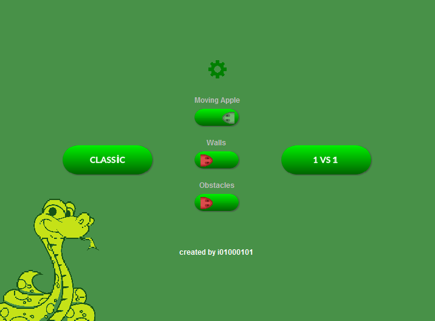
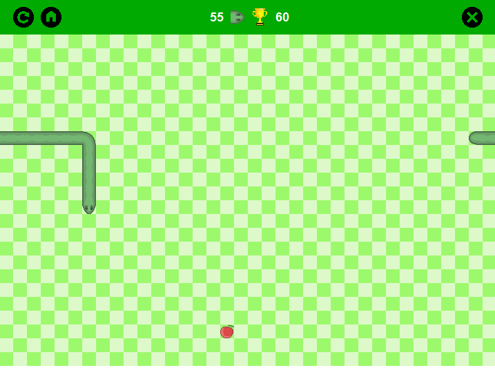
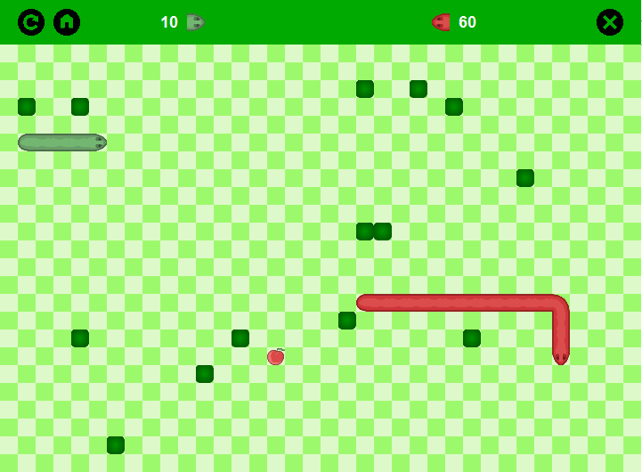

# 2-Person-Snake-Game
It's a Snake game. It has classic mode and 1 vs 1 mode. Also there is some settings. There is 16 different game option in total.

The essential point of snake games is moving of snake. My snake class has an array list that keep JLabels for each part of snake. When snake is moving, snake's head goes to direction that user choose. Then each label goes to position of the label before itself.

Main screen

You can chosee classic game or 1 vs 1 game. Also you can set 3 option. The apple can move when it's not eaten for a time. Walls can closed. And if you want game create new obstacles when one of the snakes eat apple.

Classic game

1 vs 1 with obstacles on

There is your current point and highest point on scoreboard bar.
